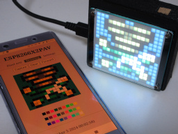
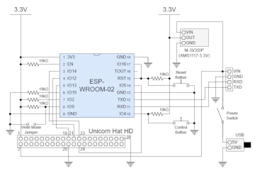
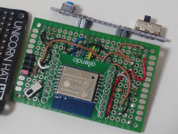
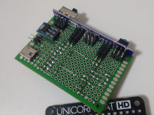
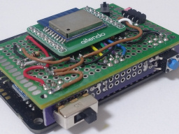

# ESP8266X2PAV (ESP8266 Hexadeca-Squared Pixel Art Viewer)

A 16&times;16-dotted pixel art viewer with **ESP-WROOM-02** and **Unicorn HAT HD**.

## Instruction

This device can display images from GIF files.
Animated GIFs are also supported.

A web application is provided. You can access http://esp8266x2pav.local:8080/ (as default) with a web browser and upload your GIF file.
Both the width and the height of the image must be within 32 pixels, and the file size must be within 64KiB.
The image is cropped if its width or height is over 16 pixels.

The next image will be displayed automatically after the specified duration has elapsed (and after the specified loop times in the case of animation GIF).
Moreover, you can force to display the next image by pressing the button.

It goes to sleep mode after the specified duration has elapsed and be resumed by pressing the button.

## Web API specification

[Here is the Web API specification](doc/webapi_spec.html) generated from ["openapi.yaml"](openapi.yaml).

## Hardware

### Components

* [ESP-WROOM-02](http://akizukidenshi.com/catalog/g/gM-09607/)
* [Unicorn HAT HD](https://shop.pimoroni.com/products/unicorn-hat-hd)
* LDO module (3.3V): [M-3V3SIP](https://www.aitendo.com/product/13061)
* Resistors: 10k&ohm;&times;6
* Wires, connectors, switches, etc...

### Schematic

### Example

## Software

### Build and transfer

Clone the source code and open the project file "ESP8266X2PAV.ino" with Arduino IDE.

You must import [ESP8266 board](https://github.com/esp8266/Arduino?tab=readme-ov-file#installing-with-boards-manager).

Also, you must modify ["credential.h"](credential.h) according to your situation.

* `HOSTNAME` and `PORT` if you like.
    * The URL to get version information will be http://esp8266x2pav.local:8080/version if you don't modify.
* `STA_SSID` and `STA_PASSWORD` according to your Wi-Fi access point setting.
    * If you'd like to assign static IP address to the device, uncomment `#ifdef STATIC_ADDRESS` and edit values of `STATIC_ADDRESS_***`.

You can build the source code with following configuration.

Attribute        |Value
-----------------|------------------------------------
Board            |Generic ESP8266 Module
Builtin Led      |2
Upload Speed     |921600
CPU Frequency    |80 MHz
Crystal Frequency|26 MHz
Flash Size       |4MB (FS:3MB OTA:~512KB)
Flash Mode       |DOUT (compatible)
Flash Frequency  |40 MHz
Reset Method     |dtr (aka modemcu)
Debug port       |Disabled
Debug Level      |None
lwIP Variant     |v2 Lower Memory
VTables          |Flash
C++ Exceptions   |Disabled (new aborts on oom)
Erase Flash      |Only Sketch
NONOS SDK Version|nonos-sdk 2.2.1+119 (191122)
SSL Support      |Basic SSL ciphers (lower ROM use)
MMU              |32KB cache + 32KB IRAM (balanced)
Non-32-Bit Access|Use pgm_read macros for IRAM/PROGMEM

Then, you can transfer the firmware binary data to ESP-WROOM-02 by any means.

### Acknowledgement

* [gifdec](https://github.com/lecram/gifdec)
* [swagger-codegen](https://github.com/swagger-api/swagger-codegen)

### License

These codes are licensed under [MIT License](LICENSE).
